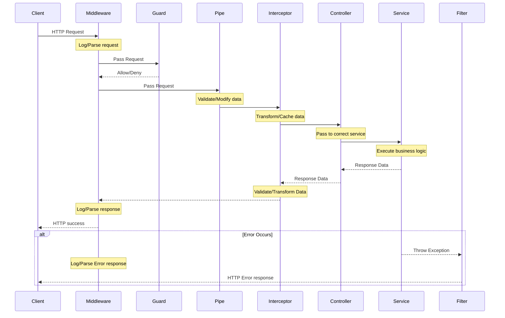

<p align="center">
  <a href="http://nestjs.com/" target="blank"></a>
</p>

[circleci-image]: https://img.shields.io/circleci/build/github/nestjs/nest/master?token=abc123def456
[circleci-url]: https://circleci.com/gh/nestjs/nest

  <p align="center">A progressive <a href="http://nodejs.org" target="_blank">Node.js</a> framework for building efficient and scalable server-side applications.</p>
    <p align="center">
<a href="https://www.npmjs.com/~nestjscore" target="_blank"></a>
<a href="https://www.npmjs.com/~nestjscore" target="_blank"></a>
<a href="https://www.npmjs.com/~nestjscore" target="_blank"></a>
<a href="https://circleci.com/gh/nestjs/nest" target="_blank"></a>
<a href="https://coveralls.io/github/nestjs/nest?branch=master" target="_blank"></a>
<a href="https://discord.gg/G7Qnnhy" target="_blank"></a>
<a href="https://opencollective.com/nest#backer" target="_blank"></a>
<a href="https://opencollective.com/nest#sponsor" target="_blank"></a>
  <a href="https://paypal.me/kamilmysliwiec" target="_blank"></a>
    <a href="https://opencollective.com/nest#sponsor"  target="_blank"></a>
  <a href="https://twitter.com/nestframework" target="_blank"></a>
</p>
  <!--[](https://opencollective.com/nest#backer)
  [](https://opencollective.com/nest#sponsor)-->

## Description
This is a pre-configured [NestJS](https://nestjs.com/) template with middlewares, logging, database connection, quick-and-easy endpoint implementation, ...  
It features an expansive testing suite with over 90% coverage.  
It generates no linting errors / warnings.  

## Project setup
#### Clone the repository with
```bash
git clone https://github.com/AroenvR/nestjs-demo.git
```

### Enter the new directory
```
cd nestjs-demo
```

#### Install dependencies
```bash
npm install
```

#### Create a .env & .env.test file
- Copy the .env.example's contents to your .env file of choice.
- Adjust the paths to the full directory paths on your environment.

## Compile and run the project
```bash
# development
npm run start

# watch mode
npm run start:dev

# production mode
npm run start:prod
```

## Running tests
Execute `npm run test` to run all tests once.  
Execute `npm run test:watch` to run all tests on watch, rerunning on each file change.  
Execute `npm run test SomeFile.test.ts` to run a specific test once.  
Execute `npm run test something` to run all files with a specific prefix once.  
Execute `npm run test:watch SomeFile.test.ts` to run a specific test on watch, rerunning on each file change.  
Execute `npm run test:watch something` to run all files with a specific prefix on watch, rerunning on each file change.  
Execute `npm run test:coverage` to run all test once with a coverage report.

## Resources
Check out a few resources that may come in handy when working with NestJS:

- Visit the [NestJS Documentation](https://docs.nestjs.com) to learn more about the framework.
- For questions and support, please visit our [Discord channel](https://discord.gg/G7Qnnhy).
- To dive deeper and get more hands-on experience, check out our official video [courses](https://courses.nestjs.com/).
- Visualize your application graph and interact with the NestJS application in real-time using [NestJS Devtools](https://devtools.nestjs.com).
- Need help with your project (part-time to full-time)? Check out our official [enterprise support](https://enterprise.nestjs.com).
- To stay in the loop and get updates, follow us on [X](https://x.com/nestframework) and [LinkedIn](https://linkedin.com/company/nestjs).
- Looking for a job, or have a job to offer? Check out our official [Jobs board](https://jobs.nestjs.com).

# Project directory structure
This project's file structure adheres to Domain Driven Design as much as possible.
```plaintext
src/
├── __tests__/          # Doesn't contain tests. Contains test configurations, setups, helpers, mocks, ...
│   ├── helpers/        # Helper functions for the test files spread throughout the server.
│   └── mocks/          # Mocks for the test files spread throughout the server.
│
├── application/        # Coordinates use cases of the application without direct business logic.
│   ├── events/         # Application services which emit events triggered by database operations.
│   └── services/       # Application services orchestrating domain services and repository interactions.
│
├── common/             # Contains values that are used accross layers.
│   ├── constants/      # Constants that are used by multiple layers.
│   ├── enums/          # Enums that are used by multiple layers.
│   ├── interfaces/     # Interfaces that are used by multiple layers.
│   ├── types/          # Types that are used by multiple layers.
│   └── utility/        # Contains the server's Utility Module and utility objects.
│
├── domain/             # Encapsulates core business logic, the domain model and its entities.
│   ├── database/       # Responsible for the application's database access.
│   └── AbstractEntity  # The parent class for all entities in the application.
|
├── external/           # External integrations and adapters for third-party services or API's.
│   ├── api_adapter/    # Adapters for external APIs, such as OpenAI or other third-party services.
│   └── events/         # Event handlers for external SSE's or notifications.
│
├── http_api/           # Encapsulates the application's HTTP interface.
│   ├── controllers/    # HTTP request handlers routing requests to the application's services.
│   ├── decorators/     # Custom decorators for Swagger documentation and request routing for Controllers.
│   ├── dtos/           # Data Transfer Objects that define data structures and handle validation.
│   ├── filters/        # Exception filters for capturing and handling endpoint errors.
│   ├── guards/         # Guards to enforce authorization and endpoint protection.
│   ├── interceptors/   # Interceptors for transforming data or handling response customization.
│   ├── middleware/     # Middleware for request processing (logging, timing, etc.).
│   └── modules/        # Modules handle Denpendency Injection and expose their respective Controllers.
│
├── infrastructure/     # Provides technical capabilities to support application and domain layers.
│   ├── configuration/  # Manages application configuration and environment variables.
│   └── AppModule       # The application's primary module, and IOC container.
│
└── main.ts             # The application's entry point where the NestJS app is bootstrapped.
```

# API Authentication & Token Management
This segment describes the authentication flow, token handling, and route protection policies for the API.

## Routes Overview
| Route                 | Public / Protected | Authentication Mechanism                                     |
| --------------------- | ------------------ | ------------------------------------------------------------ |
| **POST /auth/login**   | Public             | None. Validates credentials and issues tokens.               |
| **POST /auth/refresh** | Protected          | Requires valid `refresh_token` HttpOnly cookie.             |
| **POST /auth/logout**  | Public             | Always clears cookies; parses & revokes token if present.   |
| **All other routes**   | Protected          | Requires `Authorization: Bearer <accessToken>` **or** `X-Swagger-API-Key` header **or** HTTP-Only `access_cookie` JWT. |

---

## 1. POST /auth/login
- **Public endpoint**; no token or cookie required.

- On success:
  1. Issues an encrypted **JWT access token** (short-lived).  
  2. Sets a **`refresh_token`** as an HttpOnly, Secure, SameSite cookie.  
  3. Returns text payload:
```text
eyJhbGciOiJIUzI1NiIsInR5cCI6IkpXVCJ9...
```
---

## 2. POST /auth/refresh
- **Protected endpoint**; no `Authorization` header.  
- Reads **only** the `refresh_token` cookie.  
- On valid & unexpired cookie:
  1. Rotates the refresh token (invalidate old, set new cookie).  
  2. Issues a fresh **access token**.  
  3. Returns JSON payload:
```json
eyJhbGciOiJIUzI1NiIsInR5cCI6IkpXVCJ9...
```

- On missing/invalid cookie: responds `401 Unauthorized`.

---

## 3. POST /auth/logout
- **Public endpoint**; no guard.  
- Always clears the `refresh_token` cookie.  
- If a valid refresh token (or expired one) is present in the cookie:
  1. Parses it (ignoring expiration).  
  2. Revokes all server-side refresh-token records for that user.  
- Returns NO_CONTENT
---

## 4. All Other Routes
- **Protected endpoints**.  
- Require **one of three** on every request:  
  1. `Authorization: Bearer <accessToken>`  
  2. `access_cookie`  
  3. `X-Swagger-API-Key: <your-swagger-api-key>`  
- Returns `401 Unauthorized` if a header is missing, invalid, or expired.

---

## 5. Token & Cookie Lifecycle
1. **Login** (`POST /auth/login`)  
   - Client calls with credentials.  
   - Server responds with:
     - TEXT `ey...`  
     - HttpOnly cookie `refresh_token=<token>; Secure; SameSite=Strict; Max-Age=`
     - HttpOnly cookie `access_cookie=<token>; Secure; SameSite=Strict; Max-Age=`

2. **Using the API**  
   - Client includes `Authorization: Bearer <accessToken>` OR `X-Swagger-API-Key` OR `access_cookie` on every request.  
   - If a request returns `401 Unauthorized` (access token expired):
     1. Client immediately calls **`POST /auth/refresh`**.  
     2. On success, client replaces `accessToken` & `access_cookie` and retries the original request.

3. **Logout** (`POST /auth/logout`)  
   - Client calls (no tokens required).  
   - Server revokes all cookies that are present.

## My development setup
```bash
npm run start:dev
```

```bash
npm run test:watch
```
[Bash scripts](./scripts/) to manually test the API's endpoints.  
[SQLite Viewer](https://marketplace.visualstudio.com/items?itemName=qwtel.sqlite-viewer) to manually check the database's contents (when not using SQLCipher, otherwise just use the sqlcipher CLI).  
[Simple Browser](https://github.com/microsoft/vscode/pull/109276) to review the OpenAPI document (Ctrl + Shift + P > Simple Browser: Show)

## NestJS dataflow


## Middlewares
Middlewares in NestJS are functions that have access to the **request** and **response** objects, as well as the **next middleware** in the request-response cycle. They are executed before any route handlers, making them ideal for tasks like logging, authentication, and modifying requests. Middlewares are the first and last points of interaction during a request/response cycle, allowing for centralized processing of incoming requests and outgoing responses.

#### Key points:
- **Request Modification**: Alter or enrich incoming request data before it reaches the controller.
- **Logging**: Track and log details of each incoming request for monitoring and debugging.
- **Authentication & Authorization**: Validate user credentials and permissions before accessing protected routes.
- **Error Handling**: Catch and process errors uniformly across all routes.
- **Performance Enhancements**: Implement caching or rate limiting to optimize application performance.

## Guards
Guards in NestJS are used to determine whether a request will be handled by the route handler based on custom logic, typically for authentication and authorization. They implement the CanActivate interface and return a boolean indicating whether to proceed. Guards are executed before any interceptor or pipe, making them ideal for access control checks.

#### Key points:
- **Authentication**: Validate user credentials, such as verifying JWT tokens.
- **Authorization**: Check user roles or permissions to access specific resources.
- **Request Control**: Allow or deny requests before they reach the controller.
- **Scope Flexibility**: Apply guards globally, to controllers, or individual routes.
- **Reusable Security Logic**: Centralize access control logic for consistency and maintainability.

## Interceptors
Interceptors in NestJS allow you to intercept and manipulate incoming requests and outgoing responses. They are useful for implementing cross-cutting concerns such as logging, transforming data, handling errors, and caching. By implementing the NestInterceptor interface, you can add custom logic before and after the execution of route handlers. Interceptors can be applied globally, to specific controllers, or individual routes.

#### Key points:
- **Logging & Monitoring**: Track request durations and details.
- **Response Transformation**: Modify or format response data.
- **Error Handling**: Standardize exception handling across the application.
- **Caching:** Implement response caching to improve performance.

## Pipes
Pipes in NestJS are used to validate and transform incoming data before it reaches the route handlers. They implement the PipeTransform interface and can be applied globally, to specific controllers, or individual routes. Pipes ensure data integrity by enforcing validation rules and transforming data into the desired format. They help maintain consistency and reduce boilerplate code by handling common data processing tasks.

#### Key points:
- **Validation**: Ensure incoming data meets required criteria using built-in or custom validators.
- **Transformation**: Convert data types or formats to match expected handler inputs.
- **Parameter Handling**: Process and validate route parameters, query strings, and request bodies.
- **Reusable Logic**: Create generic pipes that can be reused across different parts of the application.
- **Error Handling**: Provide meaningful error messages when data validation fails.

## Filters
Filters in NestJS, specifically Exception Filters, handle and manage exceptions that occur during the request-response cycle. They provide a centralized mechanism to catch errors, transform them into meaningful responses, and ensure consistent error handling across the application. Filters implement the ExceptionFilter interface and can be applied globally, to specific controllers, or individual routes. By separating error handling from business logic, filters enhance code maintainability and clarity. They also integrate seamlessly with logging systems to record error details for debugging purposes.

#### Key points:
- **Centralized Error Handling**: Manage all exceptions in a single location for consistency.
- **Custom Error Responses**: Transform exceptions into standardized, client-friendly messages.
- **Separation of Concerns**: Isolate error handling from business logic for cleaner code.
- **Scope Flexibility**: Apply filters globally, to controllers, or individual routes.
- **Integration with Logging**: Combine with logging mechanisms to record error details for debugging.

## SQLCipher
Quick guide on getting SQLCipher to work with this API on an Ubuntu system.

#### Commands:
```
sudo apt-get update  
sudo apt-get install -y git build-essential python3 libssl-dev  
sudo apt-get install -y libsqlcipher0 libsqlcipher-dev sqlcipher  

export LDFLAGS="-L/usr/lib/x86_64-linux-gnu -lsqlcipher -lssl -lcrypto" 
export CPPFLAGS="-I/usr/include/sqlcipher -I/usr/include/openssl" 
export CXXFLAGS="$CPPFLAGS"

npm install sqlite3 --build-from-source --sqlite_libname=sqlcipher --sqlite=/usr --verbose 
```

Set the DATABASE_ENCRYPTION_KEY environment variable and you're good to go.  
Check out the [node-sqlite3](https://github.com/TryGhost/node-sqlite3) GitHub for more information.


# License
NestJS, as well as this template, are [MIT licensed](https://github.com/nestjs/nest/blob/master/LICENSE).