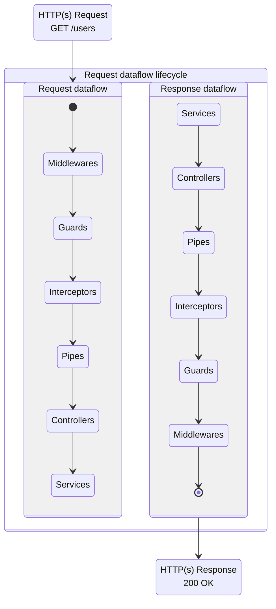
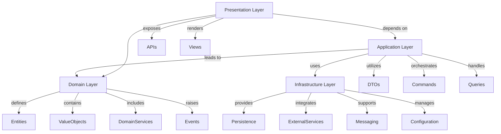
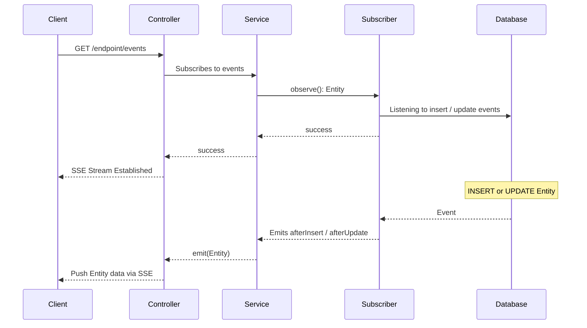

<p align="center">
  <a href="http://nestjs.com/" target="blank"></a>
</p>

[circleci-image]: https://img.shields.io/circleci/build/github/nestjs/nest/master?token=abc123def456
[circleci-url]: https://circleci.com/gh/nestjs/nest

  <p align="center">A progressive <a href="http://nodejs.org" target="_blank">Node.js</a> framework for building efficient and scalable server-side applications.</p>
    <p align="center">
<a href="https://www.npmjs.com/~nestjscore" target="_blank"></a>
<a href="https://www.npmjs.com/~nestjscore" target="_blank"></a>
<a href="https://www.npmjs.com/~nestjscore" target="_blank"></a>
<a href="https://circleci.com/gh/nestjs/nest" target="_blank"></a>
<a href="https://coveralls.io/github/nestjs/nest?branch=master" target="_blank"></a>
<a href="https://discord.gg/G7Qnnhy" target="_blank"></a>
<a href="https://opencollective.com/nest#backer" target="_blank"></a>
<a href="https://opencollective.com/nest#sponsor" target="_blank"></a>
  <a href="https://paypal.me/kamilmysliwiec" target="_blank"></a>
    <a href="https://opencollective.com/nest#sponsor"  target="_blank"></a>
  <a href="https://twitter.com/nestframework" target="_blank"></a>
</p>
  <!--[](https://opencollective.com/nest#backer)
  [](https://opencollective.com/nest#sponsor)-->

## Description
This is a pre-configured [NestJS](https://nestjs.com/) template with middlewares, logging, database connection, quick-and-easy endpoint implementation, ...  
It features an expansive testing suite with a 100% coverage.  
It generates no linting errors / warnings.  

## Project setup
#### Clone the repository with
```bash
git clone https://github.com/AroenvR/nestjs-demo.git
```

### Enter the new directory
```
cd nestjs-demo
```

#### Install dependencies
```bash
npm install
```

## Compile and run the project
```bash
# development
npm run start

# watch mode
npm run start:dev

# production mode
npm run start:prod
```

## Running tests
Execute `npm run test` to run all tests once.  
Execute `npm run test:watch` to run all tests on watch, rerunning on each file change.  
Execute `npm run test SomeFile.test.ts` to run a specific test once.  
Execute `npm run test:watch SomeFile.test.ts` to run a specific test on watch, rerunning on each file change.  
Execute `npm run test:coverage` to run all test once with a coverage report.

## Resources
Check out a few resources that may come in handy when working with NestJS:

- Visit the [NestJS Documentation](https://docs.nestjs.com) to learn more about the framework.
- For questions and support, please visit our [Discord channel](https://discord.gg/G7Qnnhy).
- To dive deeper and get more hands-on experience, check out our official video [courses](https://courses.nestjs.com/).
- Visualize your application graph and interact with the NestJS application in real-time using [NestJS Devtools](https://devtools.nestjs.com).
- Need help with your project (part-time to full-time)? Check out our official [enterprise support](https://enterprise.nestjs.com).
- To stay in the loop and get updates, follow us on [X](https://x.com/nestframework) and [LinkedIn](https://linkedin.com/company/nestjs).
- Looking for a job, or have a job to offer? Check out our official [Jobs board](https://jobs.nestjs.com).

## Quickly creating a new API endpoint
Two abstract classes were created for quickly setting up new endpoints.  
1. [AbstractController](./src/abstract/AbstractController.ts) for all generic CRUD requests (GET / POST / PATCH / DELETE)  
2. An accompanying [AbstractService](./src/abstract/AbstractService.ts) for connecting to a database. The abstract class only throws a HttpException with METHOD_NOT_IMPLEMENTED as it would be dangerous to accidentally create a fully functional endpoint.

For an example of how to easily set up a new endpoint, refer to the [templates](./src/template/) and [template test](./src/__tests__/template/) directories. They can be utilized for creating new endpoints with the Abstract classes (just copy-paste the templates & change the names).

## My development setup
```bash
npm run start:dev
```

```bash
npm run test:watch
```
[Thunder Client](thunderclient.com) to manually test the API's endpoints.  
[SQLite Viewer](https://marketplace.visualstudio.com/items?itemName=qwtel.sqlite-viewer) to manually check the database's contents.
[Simple Browser](https://github.com/microsoft/vscode/pull/109276) to review the OpenAPI document (Ctrl + Shift + P > Simple Browser: Show)

## License

Nest, as well as this template, are [MIT licensed](https://github.com/nestjs/nest/blob/master/LICENSE).

## NestJS object concepts


## Middlewares
Has access to the `request` and `response` objects and is the first and last object to be called during a request/response cycle.

## Guards
Usually a security check, such as validating JWT's on any controller that implements the Guard before data is given to the data's handler.

## Interceptors
An Interceptor ...? TODO

## Pipes
Used for validating and transforming data before passing it to the data's handler.

### Layered Architecture Explanation

1. **Domain Layer**: 
   - This is the heart of DDD and contains the domain model, including entities, value objects, aggregates, domain services, and domain events. It's responsible for expressing the business logic.
   - **Common Directories**: `Entities/`, `ValueObjects/`, `Repositories/`, `DomainServices/`, `Events/`

2. **Application Layer**: 
   - This layer orchestrates the application's use cases. It does not contain business logic but coordinates operations provided by the domain layer.
   - **Common Directories**: `DTOs/`, `Services/`, `Commands/`, `Queries/`

3. **Infrastructure Layer**: 
   - This layer provides technical capabilities necessary for the application and domain layers, such as data persistence, external service integration, and messaging.
   - **Common Directories**: `Persistence/`, `Messaging/`, `ExternalServices/`, `Configuration/`

4. **Presentation Layer**: 
   - This is where the application's UI or API is defined. It handles user interactions and routes calls to the application layer.
   - **Common Directories**: `Controllers/`, `Views/`, `APIs/`, `ViewModels/`

### Mermaid Diagram



### Documentation & Testing Considerations

- **TSDoc and Code Comments**: For the C# ABP framework, consider using XML comments to document your code, similar to TSDoc in TypeScript, to help generate documentation.
  
- **Testing**: 
  - **Mocking**: Ensure that interfaces within each layer are easily mockable to facilitate unit testing.
  - **Tools**: Utilize tools such as xUnit or NUnit for unit testing in C#. Implement integration tests to verify interactions across layers.

### Security and Logging

- **Security**: 
  - Implement security best practices consistent with ABP guidelines, such as use of authorization attributes and strong input validation.
- **Logging**:
  - Integrate a robust logging strategy using libraries like Serilog to capture and manage logs efficiently across all layers.

Implementing these architectural principles and practices not only aligns your project with DDD and ABP conventions but also ensures a secure, maintainable, and scalable system.

# File structure
```plaintext
src/
├── application/        # Coordinates use cases of the application without direct business logic.
│   ├── dtos/           # Data Transfer Objects that define data structures and handle validation.
│   ├── modules/        # NestJS Modules that handle Denpendency Injection and expose the Controllers.
│   ├── services/       # Application services orchestrating domain services and repository interactions.
│   ├── events/         # Application services which emit events triggered by database operations.
│   └── controllers/    # HTTP request handlers routing requests to application services.
│
├── domain/             # Encapsulates core business logic and domain model.
│   └── entities/       # Business entities representing database objects.
│
├── infrastructure/     # Provides technical capabilities to support application and domain layers.
│   ├── logging/        # The application's logging mechanisms.
│   ├── database/       # Responsible for the application's database access.
│   └── configuration/  # Manages application configuration and environment variables.
|
├── common/             # Includes cross-cutting concerns and shared utilities.
│   ├── middleware/     # Middleware for request processing (logging, timing, etc.).
│   ├── guards/         # Guards to enforce authorization and endpoint protection.
│   ├── interceptors/   # Interceptors for transforming data or handling response customization.
│   └── filters/        # Exception filters for consistent error handling across the application.
│
└── main.ts             # The application entry point where the NestJS app is bootstrapped.
```

## Sequence diagram depicting SSE (Server-Sent Events) flow

