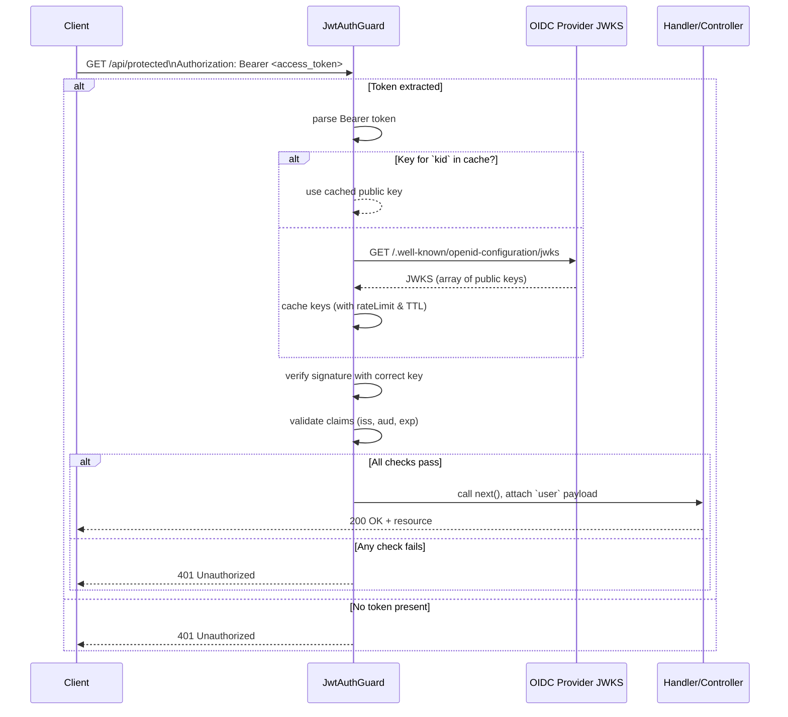

```mermaid
sequenceDiagram
    participant C as Client
    participant G as JwtAuthGuard
    participant JWKS as OIDC Provider JWKS
    participant H as Handler/Controller

    C->>G: GET /api/protected\nAuthorization: Bearer <access_token>
    alt Token extracted
        G->>G: parse Bearer token
        alt Key for `kid` in cache?
            G-->>G: use cached public key
        else
            G->>JWKS: GET /.well-known/openid-configuration/jwks
            JWKS-->>G: JWKS (array of public keys)
            G->>G: cache keys (with rateLimit & TTL)
        end
        G->>G: verify signature with correct key
        G->>G: validate claims (iss, aud, exp)
        alt All checks pass
            G->>H: call next(), attach `user` payload
            H-->>C: 200 OK + resource
        else Any check fails
            G-->>C: 401 Unauthorized
        end
    else No token present
        G-->>C: 401 Unauthorized
    end
```