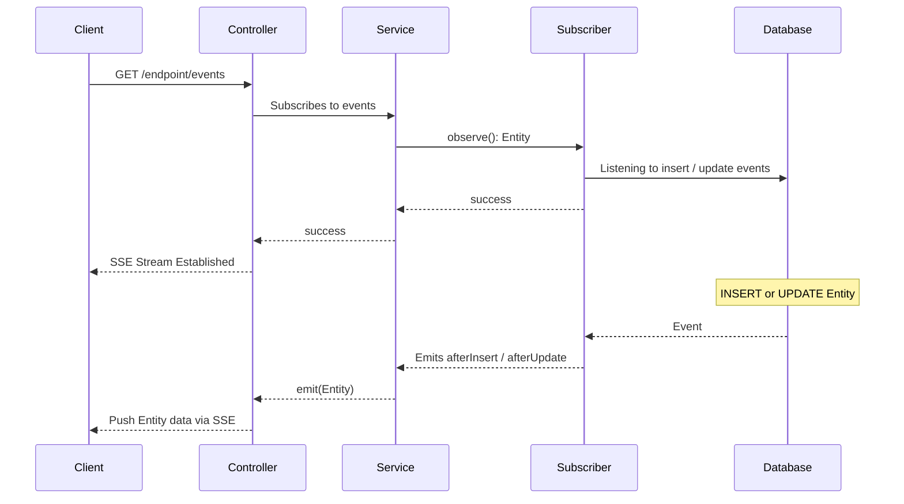

## Sequence diagram depicting SSE (Server-Sent Events) flow

```mermaid
sequenceDiagram
    Client->>Controller: GET /endpoint/events
    Controller->>Service: Subscribes to events
    Service->>Subscriber: observe(): Entity
    Subscriber->>Database: Listening to insert / update events
    Subscriber-->>Service: success
    Service-->>Controller: success
    Controller-->>Client: SSE Stream Established

    Note over Database: INSERT or UPDATE Entity

    Database-->>Subscriber: Event
    Subscriber-->>Service: Emits afterInsert / afterUpdate
    Service-->>Controller: emit(Entity)
    Controller-->>Client: Push Entity data via SSE
```