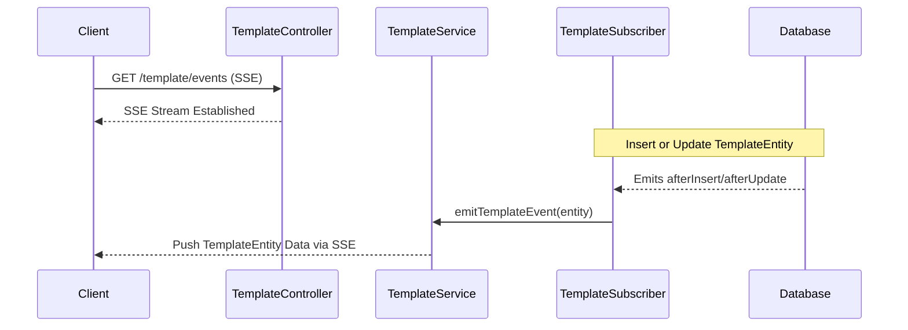

```mermaid
sequenceDiagram
    participant Client
    participant TemplateController
    participant TemplateService
    participant TemplateSubscriber
    participant Database

    Client->>TemplateController: GET /template/events (SSE)
    TemplateController-->>Client: SSE Stream Established

    Note over Database,TemplateSubscriber: Insert or Update TemplateEntity

    Database-->>TemplateSubscriber: Emits afterInsert/afterUpdate
    TemplateSubscriber->>TemplateService: emitTemplateEvent(entity)
    TemplateService-->>Client: Push TemplateEntity Data via SSE
```